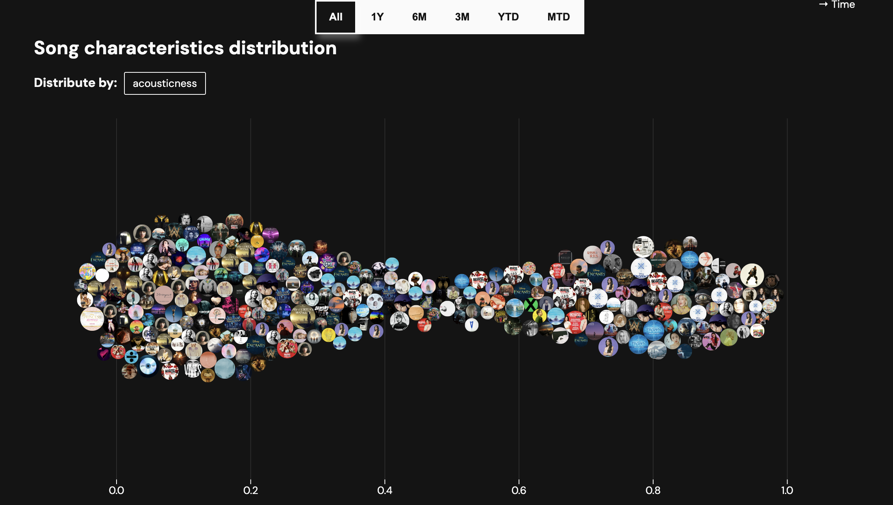
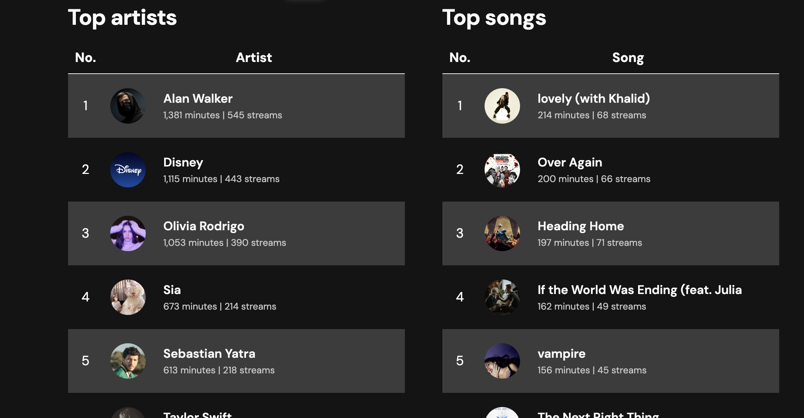

# Spotify Statistics

Analyze your Spotify listening data from [Spotify](https://www.spotify.com/us/account/privacy/).

## Features

❌ Colored calendar showing listening time by day

❌ Genre and song analysis breakdown (songs on scale for each factor, and 2-dimensional comparison with selectable
factors)

❌ Quiz (5-second snippets and make user guess song name)

❌ Allow album categorization

## Usage

|  |  |
|--------------------|--------------------|
|  |  |
|  |

1. Download your **Extended Streaming History** data from [Spotify](https://www.spotify.com/us/account/privacy/) (note:
   this may take up to 30 days).
2. Visit the [dashboard](https://chjus.github.io/StatsforSpotify/) and upload the `.zip` file.

### Privacy

All code is open-source and publicly available. The webpage is statically hosted on Github. All data is cached on the
client-side,
no data is saved on the server. 